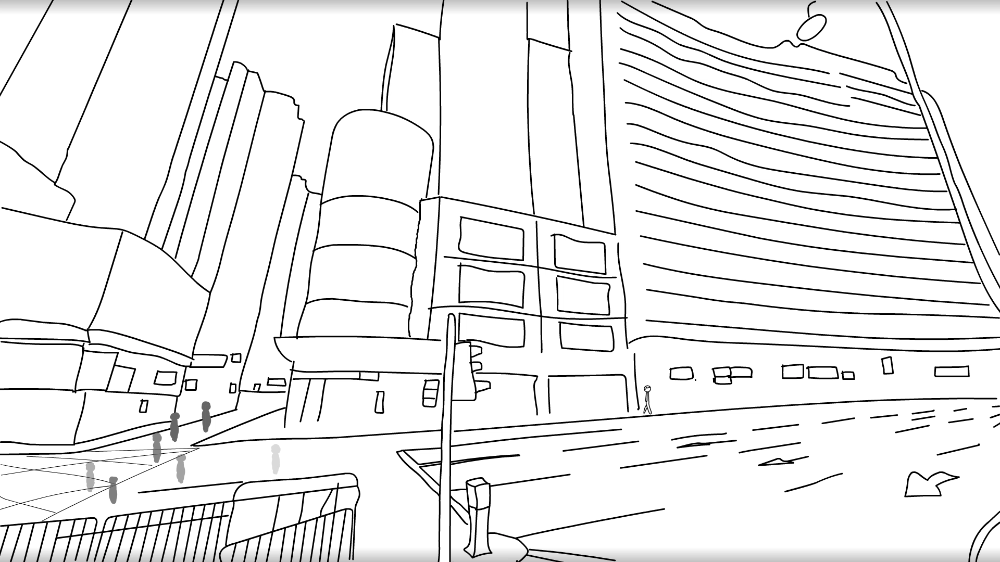

# About

With Every Moment

Created by Julian Knodt

[https://vimeo.com/336155504](https://vimeo.com/336155504)

A characterization of unhappiness from constant work and stress.

Thanks to [Freesound.org](https://freesound.org/) for all the sounds, list of used sounds
[here](sounds.md).

The moodboard and development site are [here](readme.md).

## Project Idea
I came up with the idea fairly randomly, but I was thinking about making it focus a lot more
on religion and religious beliefs at the start, since I'm in a class on religions of China. Of
course, since I don't actually practice, I don't have much to say about it. Thus, it ended up
being a lot more about the monotony of working and a critique on the lack of values in society.
I thought that the daily grind of just constant working with little time for things of deeper
meaning has lead many people to become unhappy, and that by reflecting on the events of the past
such as Tiananmen square and how people used to be so moved by religion would people now begin
to feel that maybe the ordering of society now is not ideal. I'm not sure if my film can convey
that effectively in 2:45.

## How
A lot of the scenery was rotoscoped from random images found online. For the city in specific, I
went onto google maps, and dropped a pin in Hong Kong and just walked around until I found a
suitably interesting looking landscape, as I could not find any perspectives that I liked from
just images. I used animate even for stills, as I'm not sure how to add shading as effectively
as some others projects. The blue that is used throughout is actually a random image I took of
the sky at some point, and I just used After Effects to mask it in at the tank scene, the eyes,
the tear drop, and the picture frame. The blur in the mirror is also a Gaussian Blur added in
After Effects. The character's walk scenes were hand-drawn, and that's why they often look a
little funnier than the rest of the film. After realizing that one was proportioned incorrectly,
rather than redraw the whole thing I just rescaled each frame manually.

In terms of storage, I was very fortunate to have a friend who let me borrow her Adobe CC
account to use animate on my own computer for the project. I then used Git and Github to hold
all the animate files and transfer them from my own computer to the machine in the studio where
I stitched them together. I never needed to keep old copies of files because Git already keeps
diffs, so it helped manage the project a lot more as well. I also hosted the moodboard on
github, which was super convenient since I could easily share resources.

## Future Works
This project was incredibly time consuming, and I initially tried a bunch of different
techniques for drawing this. I ended up picking the simplest method of rotoscoping and using a
simple brush stroke with just black and white. If I were to work on future projects I might try
deviating from that more, and doing more hand-drawing and more stylization, depending on how
long I have to work on the project. One thing I regret is not iterating quicker in the
beginning, as in the end I was doing a bunch of small edits every day and getting quick
feedback, and that was much more effective for working quickly. Of course that depended on me
getting a minimum viable scene out, and that took a while at the start.

