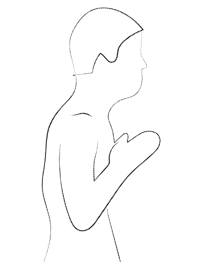

# Mood Board for Animation

This is the mood board for an animation class,
as well as a repository to contain resources for transfer between machines.

It is a github repository mainly because it is easy to create, as I'm already familiar with the
tech, and an easy way to share resources between everything and provides an easy way to create
websites.

Without further ado:

[Lawsons' Convenience Store](https://en.wikipedia.org/wiki/Lawson_(store))

City: Nanjing Road(Picture not selected)

## Plot

The overarching theme of the plot is the idea of self discovery, and reaching an understanding
of one's place in the world. It follows the life of a boy, and his journey.

It starts off with him going to the funeral for people he doesn't know well, but are a part of
his community. The boy reflects on the value of life, and then realizes he doesn't understand
why he is here in the world the scene ends as the boy leaves the chapel, and the door slams.

It picks up with an older version of the boy, standing inside a new room with his suitcases. He
lays down pictures from the original scene on a desk, so that he is easily recognized as the
same person. He goes to look at himself in a mirror, but the mirror is covered in dust, and thus
the boy cannot see himself. It cuts to a scene of him putting on working clothes, and going out,
to indicate that he is going to work.

Then, there are a series of scenes in which he can be seen working hard, not just on studies,
but on his spirit, and physically. During this same time, radio of protests and rebellions comes
over top, and the scenes intensify to match the intensifying nature of the world. This part ends
on a scene where he is finished working his job, and leaves.

He enters a grocery store, and it holds for some number of seconds. He comes out holding some
bags of groceries. He then exits in the other direction. He is walking along a dimly lit path,
but the sounds intensify until the point in which they vanish, and the man pauses and hears the
sounds of the night. He continues to walk, until ending up in front of a line of tanks, and
continues to stand there. It cuts to the man in front of the mirror, but now the mirror is
clear. The lights go off, and the sounds of sheets can be heard.

# Progress Checks

April 11, 2019:
Did some technique tests, animated the wooden man dummy and also drew a moving hold for a
church which can be used as a background. I think I ended up with just using 3.00 fixed width
paint brush for most of it. I also rotiscoped Future Kid Conan because I think that might be the
style I want to use for the young version of the person

April 12, 2019:
I think I realized what I want to do to make it more aesthetically pleasing. After watching
World of Tomorrow, I want to add glitched images as backgrounds to some of the images, and that
can be added in after effects with masking. I also hope to use edge detection on some images to
make them less realistic and then apply glitchiness to those.

April 16, 2019:
Worked a little bit on the tank scene and found a good reference image for the convenience
store. Decided to use a picture of Lawson's from wikipedia. I'm not sure if I can properly
capture the lighting but it's a moody picture.

April 17, 2019(Midnight):
Woops, stayed up late working on this. I drew the scene for the room. I'm not sure, but I might
just animate the door sliding, and background to the window. I could just add him in walking
afterwards, but I'm not sure if that would be sufficient. I also intended to draw a picture
frame, but as of writing this I'm not sure if I'll finish.

April 18, 2019(Around 9 P.M.):
I was looking at references of biking, and noticed that people casually biking at home are very
different than the gifs online. They tend to bike with their bike completely straight, but
online, everyone is hunched over. It makes it hard to draw an animation of someone casually
biking.

(1:40 A.M.)
Bruh, I ended up cutting a lot of time from my initial scenes, because I can't hold an image for
30 seconds and expect people to care. I also feel that I did not end up adding a ton from last
week, even though I did a lot of work. I still have a lot more to go, but I'm going to rest
before class tomorrow.

April 19, 2019(11:03 A.M.):

Rethinking some of my design choices before the Animatic is being shown... I'm not sure if I
want to switch to just line art, or use black and white colors. Gonna have to keep
experimenting. I'm curious how other people's animatics will be, because mine felt sparse.

## Sounds:
List of sounds is [here](sound.md).

[Mood-Board](https://julianknodt.github.io/TITLE_GOES_HERE/)
